# 👋 Hi, I'm Junzhe Shi

### CS @ Johns Hopkins · Clinical NLP & LLM Research · Adams Lab

---

## What I do

I'm an undergrad researcher at Johns Hopkins working on **clinical NLP** — teaching LLMs to extract meaningful signals from electronic health records. My focus is on entity extraction (ATDD scores, medication starts) and inferring patient social relationships from unstructured clinical text.

Currently in **Adams Lab** (PI: Roy Adams, Co-PI: Jenna Mammen), bridging modern LLMs with real-world EHR data from the REACH system.

## Tech stack

## GitHub stats

## Featured projects

- **atlas-custom-schedule-events** — LLM-agent course scheduler handling complex constraints and preference optimization
- **alignment-cards** — Interactive alignment tool for AI safety concepts

---

<i>Building things that make healthcare smarter, one model at a time.</i>

